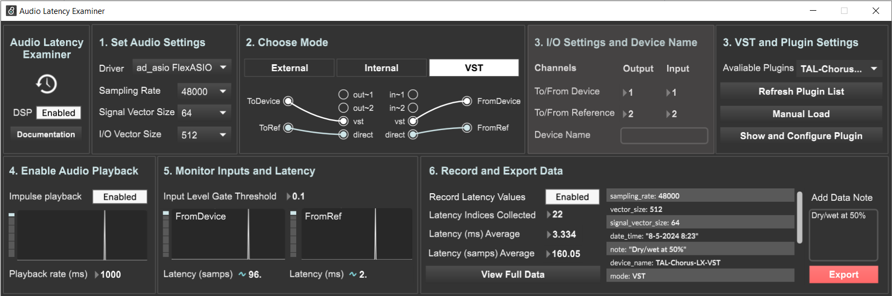

# Audio Latency Examiner (ALEX)

 

Audio Latency Examiner (ALEX) is an easy-to-use standalone app for batch collecting audio latency data from any external or internal musical device. You can use it to collect data from devices such as analog hardware, networked systems, virtual audio drivers, VSTs, and more. The app collects latency data by evaluating the arrival time differences between audio impulses (click~) that the software itself administers and passes through a given audio device.

Software documentation and more info about how ALEX works can be found on this blogpost:

- https://aleksati.net/works/audio-latency-examiner
